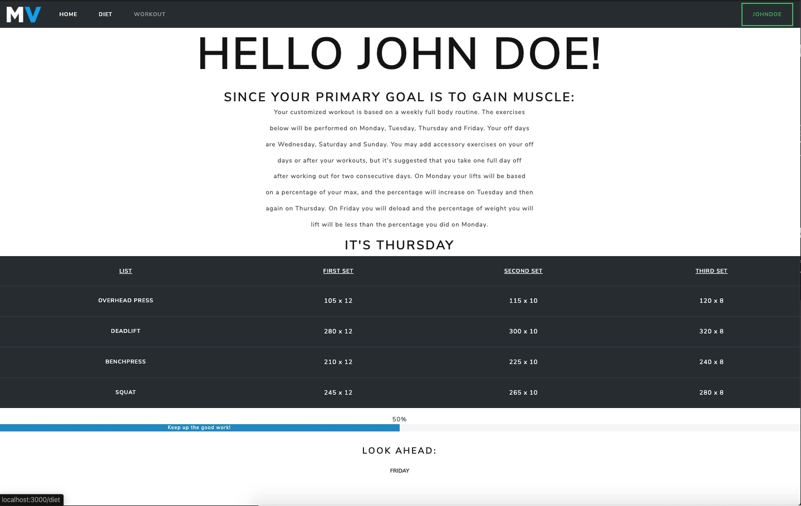

# Final Report

## Team: Modus Vivendi
Members: 
* Jimmy Neville
* Dusting Craig 
* Kishan Patel 
* Chandler Lampe 

Each member contributed equally throughout the semester, and the roles did not change.

## Introduction
Modus Vivendi is a fitness web application.

The motivation for doing this project was primarily an interest in undertaking a challenging project in an interesting area of learning a new language and the opportunity to gain experience.

Our approach to this project setup workout page and diet page, then Login/Register page. We assigned each page to team members such as workout page and diet page was given to Jimmy Neville, Login/Registration to Kishan Patel and Dustin Craig, Navbar and logging in was created by Dustin Craig, and all pages designed by Chandler Lampe. 

No changes were required in design or development plans. 

The result of the web application has turned out great. 

## Customer Value
The targeted customers are the ones that are looking to lose weight, better their exercise plans, or just get into healthy habits. The reason this app is necessary is because most apps either focus on one area: food plans or work out plans. This app will be unique to the market because it will focus on both equally. Focusing on both allows our customers to cut down on apps they use and paves the way for a better fitness program. 

There were no changes in this section.
## Technology
Our fitness app combines the benefits of tracking macronutrients and physical fitness in a way that’s user friendly and efficient. The application develops workout plans and macros that assist the user in obtaining their current fitness/weight loss goals. The technologies that we use to deliver the application are React, Express and Node.js. React is a front-end library that uses JSX to build user interfaces. Express is a web application server framework for Node.js, and Node.js is a server-side environment that executes Javascript code outside of the browser. This stack is commonly referred to as the MERN stack, and it provides the tools and libraries needed to develop a high-quality, full-stack, web application.

We initially planned on using mongodb to set up a database, but we were not able to implement the food database due to time constraints and the global COVID-19 pandemic messing with everyone’s schedule. 

<em>Screenshot of working example (workout portion):</em>  

## Project Management
We completed nearly all of our goals. After the status report update, we realized that we were not going to be able to include the food database and went with the approach of laying out your nutritional facts based on your statistics(height, weight, etc) and leaving it completely up to the user to find the right foods. In doing this, we were able to still get the message across: here’s what you need to intake for the day.

Other than that, we have remained on schedule and accomplished everything that we have set out to do.

## Reflection
We are satisfied with our final project and consider it a success. We would have liked to add more features and components, but considering how the semester dramatically changed due to the coronavirus, we are content with what we have. Each iteration went as planned and was completed on time, and every member in the group was exposed to a new language/library, and deveolped new skills that will be beneficial as a computer science student moving forward and as a software engineer. 
